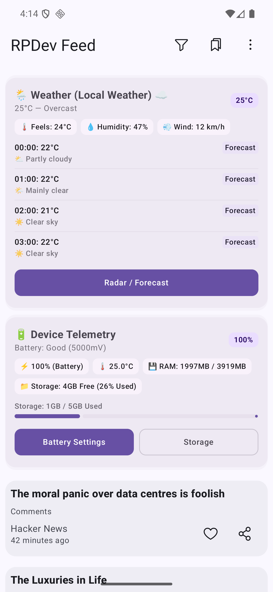
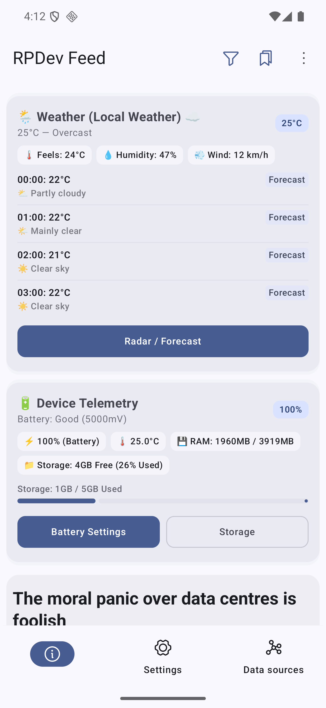
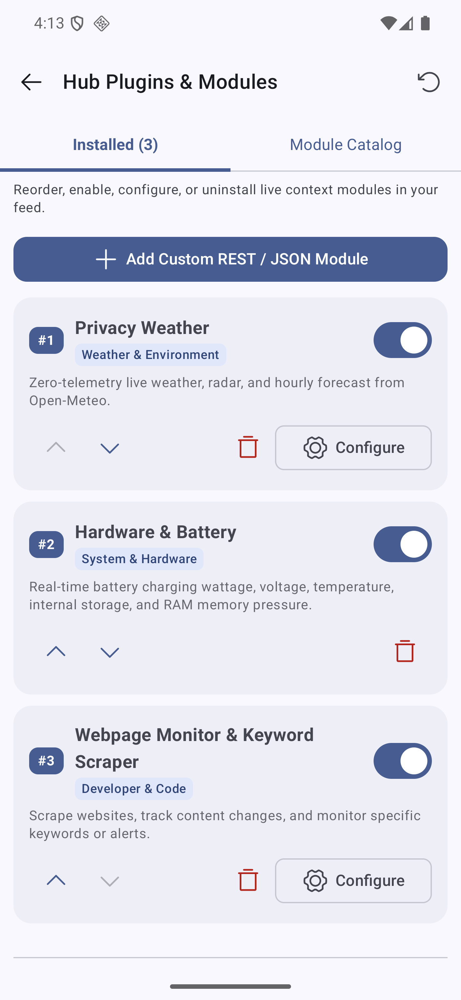
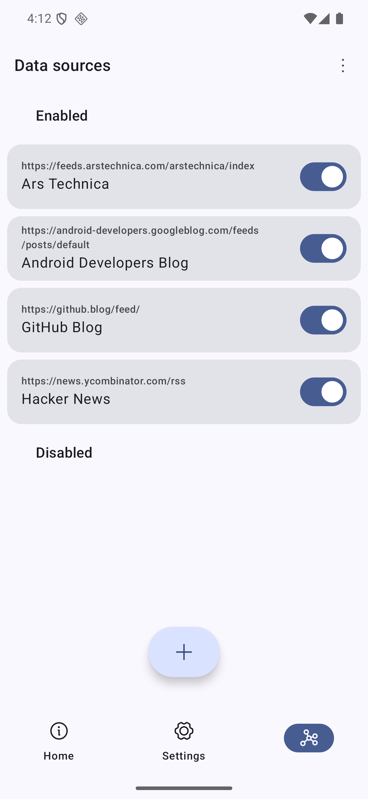
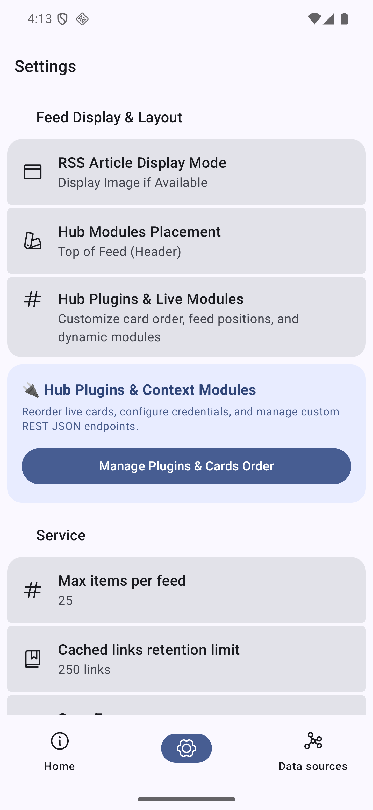

<h1 align="center">
  
   
  RPDev Feed
</h1>

<strong>Modern Privacy-First Context Hub &amp; Discover Feed Companion for Android Launchers</strong>

---

## 📖 Overview

**RPDev Feed** is a privacy-first, lightweight companion feed and context hub engine for **RPDev Launcher**, Lawnchair, and other modern Android launchers. It decouples resource-intensive context intelligence (weather, agenda, sensors, push hooks, and news) from the core launcher, keeping the home screen ultra-fast.

---

## ✨ Key Features

### 🌦️ Zero-Telemetry Privacy Weather (Open-Meteo)
- **Zero API Keys Required**: Fetches live temperature, weather condition codes (WMO), apparent temperature, humidity, wind speeds, and hourly forecast tracks directly from Open-Meteo.
- **Privacy-First**: No location tracking or telemetry sent to third parties.

### 📅 On-Device Calendar Agenda Engine
- **Next 24-Hour Agenda**: Queries local Android `CalendarContract` provider to display upcoming meetings, locations, and time chips.
- **One-Tap Event Action**: Tap any event card to open your device calendar app directly.

### 🔋 Real-Time Hardware & Battery Telemetry
- **Battery Health & Charge Power**: Live wattage, charging state, battery voltage, temperature, and current flow.
- **System Memory & Storage Gauges**: Real-time internal storage utilization and available RAM pressure indicators.

### 📡 Broadcast Push & Custom REST Ingestion
- **Live Broadcast Receiver**: Send intents (`iamrp.dev.feed.ACTION_POST_CARD`) from Tasker, Termux, or Automate to inject cards dynamically into your feed overlay.
- **Custom REST Polling**: Integrate Home Assistant, Uptime Kuma, and Gotify alerts into custom feed cards.

### 🔌 Modular Plugin System & GitHub Pulse
- **`HubPlugin` SPI Engine**: Extensible plugin architecture with decoupled lifecycle hooks, custom preference sheets, and card generators.
- **GitHub Pulse Module**: Real-time GitHub commit feeds, workflow dispatch status indicators, star tracking, and repository health metrics.
- **Card Archetypes**: Standardized Material 3 card renderers (Metric, Timeline, Progress, Action, Composite).
- **Plugin Manager UI**: Toggle, customize, and arrange active plugins on the fly.

### 📰 RSS, Atom & JSON Feed Reader
- **Multi-Format Ingestion**: Ingest RSS, Atom, and JSON Feed v1.1 channels with offline caching and read-it-later bookmarking.
- **Adaptive Layouts**: Full support for phones, foldable tablets, and landscape desktop mode.

---

## 📱 Screenshots (Android 16 - DevPixel16)

|  |  |  |
|:---:|:---:|:---:|
| **Live -1 Screen Overlay** | **Feed App &amp; Radar View** | **Hub Plugins Manager** |

|  |  |  |
|:---:|:---:|:---:|
| **Module Repository Catalog** | **Data Sources &amp; Channels** | **Feed Display &amp; Settings** |

---

## 📱 Supported Launchers

- **RPDev Launcher (Recommended)**
- Neo Launcher
- Lawnchair
- Shade Launcher / Smart Launcher (via Feed Bridge)

## Community :speech_balloon:

You can join either our [Telegram](https://t.me/neo_launcher) or [Matrix](https://matrix.to/#/#neo-launcher:matrix.org) groups to make suggestions, ask questions, receive news, install test builds, or just chat.

## Translation :left_speech_bubble: 

Contribute your translations to Neo Feed on [Hosted Weblate](https://hosted.weblate.org/engage/neo-feed/).   Adding new languages is always accepted and supported.

## Special Thanks :heart:

[iTaysonLab](https://github.com/iTaysonLab) as the project is a fork of his HomeFeeder.

[DrawerOverlayService](https://github.com/FabianTerhorst/DrawerOverlayService) as base for overlay service.

[Helena Zheng](https://helenazhang.com/) & [Tobias Fried](https://tobiasfried.com/) for the great [Phosphor Icons](https://phosphoricons.com/), we gladly use.

### Contributors :handshake:

## Copylefted Libre License :scroll:

Licensed under the [GPLv3+](/LICENSE).

Copyright © 2025 [Saul Henriquez](https://github.com/machiav3lli) & [Antonios Hazim](https://github.com/machiav3lli)

